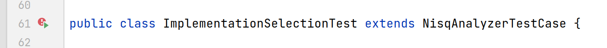
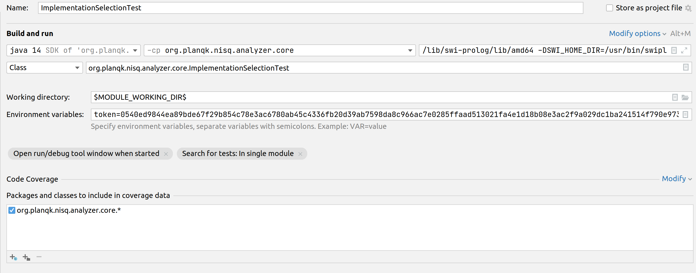
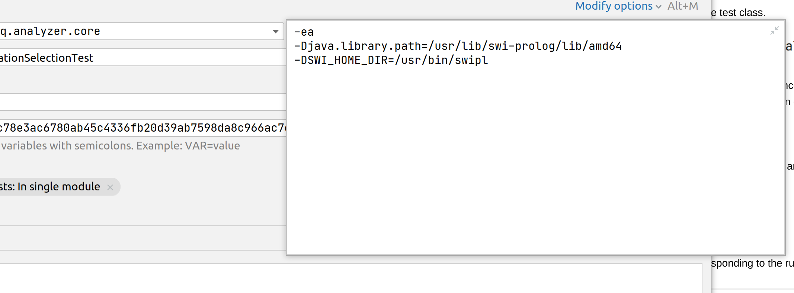

# Unit Tests

In the following it is explained, how IntelliJ needs to be  configured for the execution of Unit-Tests.

##1. First Run 
Unit tests are automatically detected and can be started by the short-cut icon right above the test class.

Doing this for the first time automatically creates a run configuration for the unit tests. This configuration is incomplete by default and needs to be adapted as discussed in the next section. Note that running a single test method creates a different run configuration, e.g.

To my best knowledge there doesn't exist a solution to configure a single run configuration that is applied to an entire set of possible runs. If you know a better solution share it here. 

##2. Adapt Run Configuration
To edit the run configuration navigate to **Run>Edit Configurations** and select the tab corresponding to the run of the previous section.
The following changes are required:


- set an environment variable for the IBMQ token
  ```
  token = ***THISISMYIBMQTOKEN*****
  ```



- Run the JVM with parameters for linking the Prolog libs correctly e.g.
  ```
  -Djava.library.path=/usr/lib/swi-prolog/lib/amd64
  -DSWI_HOME_DIR=/usr/bin/swipl
  ```
  The exact location depends of course on your system.

After configuring it once you never need to touch the configuration unless your IBMQ token changes.

##3. Docker Container
The unit tests expect that there is a database running in background and additionally all instances that belong to the various SDK services.
The simplest solution is to run the docker compose provided in 

```
docker-compose -f resources/test-compose.yml up -d
```